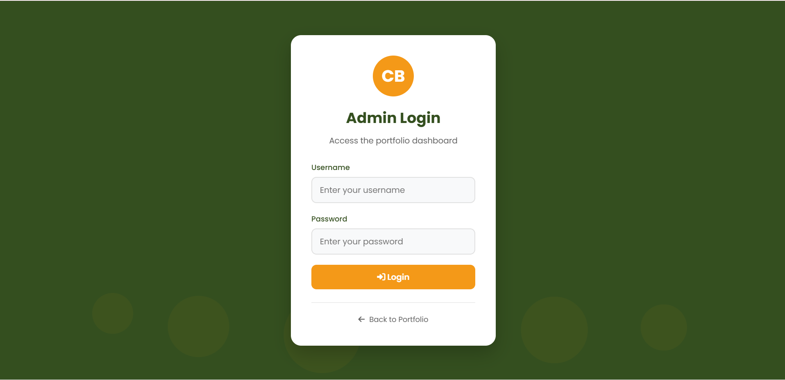
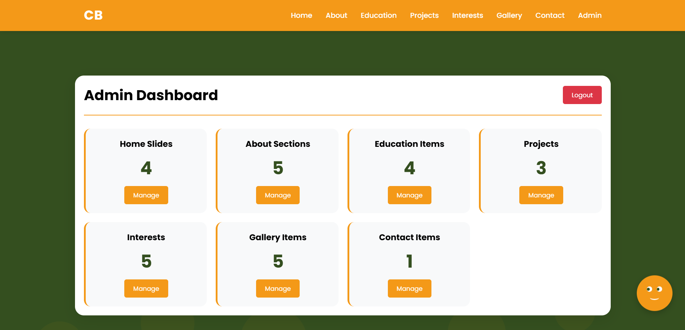

# 🎨 **Christian Boateng — Full-Stack Editable Portfolio**

> A modern, customizable portfolio system. This README showcases the project features. *(Source code is private.)*

---

## ✅ **Project Overview**

This is a **full‑stack, database‑powered portfolio website** with an integrated **admin dashboard** that allows full customization without editing code.

Users can log in to update everything — profile, about section, projects, skills, images, icons, and more.

> 🔐 **Source code is private.** Only the portfolio demo is public.

---

## ✨ **Key Features**

✅ Full admin dashboard — no coding required
✅ Change skills, interests, education, and experience
✅ Add, remove, and reorder projects
✅ Upload new images and update icons
✅ Update About & profile content
✅ Secure login system
✅ Changes reflect instantly

---

## 🧰 **Tech Stack**

| Category | Tools                       |
| -------- | --------------------------- |
| Frontend | HTML, CSS, JavaScript, Flux |
| Backend  | Full‑stack with admin panel |
| Database | Private                     |

> Designed for easy customization and future expansion.

---

## 🔧 **Admin Dashboard Controls**

From the dashboard, the user can modify:

* 🧍 Profile information
* 📝 About content
* ⚙️ Skills & Interests
* 🎓 Education
* 📂 Projects
* 🔗 Social links

> All without touching the source code.

---

## 🖼️ **Screenshots**

> Showcase interface previews here

---

## 🍃 **Why This Portfolio Stands Out**

Most portfolios are static and require coding for updates — not this one.

✅ Admin customization
✅ CMS‑like structure
✅ Zero code changes needed
✅ Great for non‑technical users

---

## 🔗 **Live Demo**

*([My portfolio](https://christianboateng.sevalla.app/))*

---

## 👨‍💻 **Author**

***Christian Boateng***

---

## 📄 **License**

This project is for **showcase only**.
The source code is **private**.
